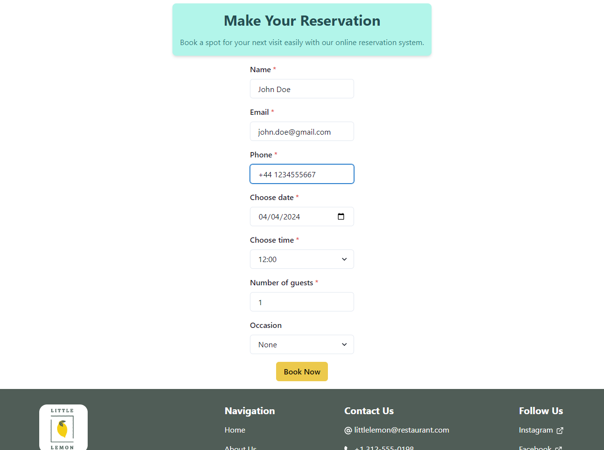
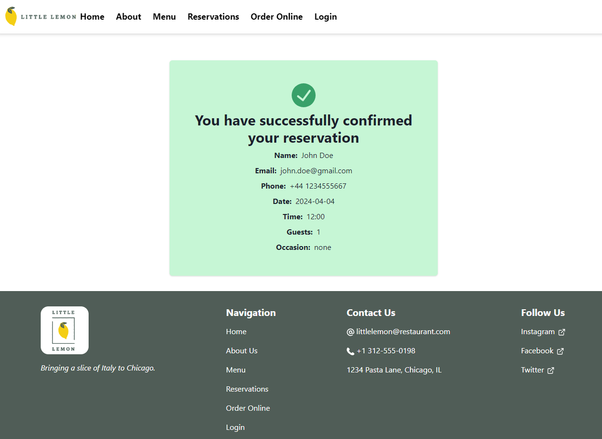

# Little Lemon Restaurant Website

This repository contains the source code for the "Little Lemon" restaurant website, a fictitious restaurant created as part of the Coursera Certification for Front-End Developer offered by Meta. The project showcases a modern web application built with React, demonstrating key front-end development skills and technologies.

You can try out the Front End application at this [link](https://nickpolvani.github.io/little_lemon/).

The application at the moment supports the functionality to book a table. View pages below:

### Landing Page


### Reservations Page


### Booking Confirmation Page


## Getting Started

To get this project up and running on your local machine, follow the steps below. Make sure you have [Node.js](https://nodejs.org/) installed before starting.

### Installing npm packages
After cloning the repository, you need to install the necessary npm packages. Navigate to the project directory and run:
```
npm install
```

### Running the Application

Start the development server to run the app in your local environment:

```bash
npm start
```

This command runs the app in development mode. Open [http://localhost:3000](http://localhost:3000) to view it in your browser. The page will automatically reload if you make edits, and you will see any lint errors in the console.

### Running Tests

To run tests in interactive watch mode, use:

```bash
npm test
```

This command launches the test runner. See the section about [running tests](https://facebook.github.io/create-react-app/docs/running-tests) for more information.

### Building for Production

When you're ready to deploy the app to Github Pages, build the app for production:

```bash
npm run build
```

In case you would like to fork the repository and deploy to your own website, you should edit the `homepage` field in the `package.json` file to match your repository name.